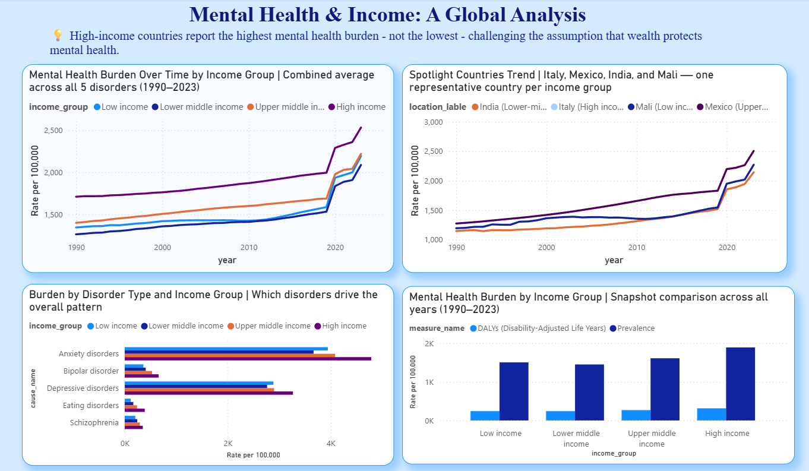

# Mental Health & Income: A Global Analysis

An exploratory data analysis project investigating whether a country's income level relates to the burden of mental health disorders, using 34 years of global health data. Built as an end-to-end portfolio project: data cleaning and merging in Python, exploratory analysis in Jupyter, and visualization in Power BI.

## Research Question
Does economic development (income level) correlate with the burden of mental health disorders globally — and does this relationship hold both in prevalence (how common) and DALYs (how severe)?

## Key Insight
High-income countries report the highest mental health burden — not the lowest — challenging the assumption that wealth protects mental health. This pattern has held consistently for 34 years (1990–2023) and holds across both prevalence and DALYs.

## Other Findings
- Anxiety and Depression drove a sharp spike in burden starting around 2019-2020, likely linked to COVID-19 — the other three disorders (Bipolar, Schizophrenia, Eating disorders) stayed flat over the same period.
- Within the same income group, individual countries can vary widely (e.g., among High income countries, Portugal's prevalence is nearly 3x Seychelles') — income level is a partial explanation, not the whole story.
- Four spotlight countries — Italy (High income), Mexico (Upper-middle), India (Lower-middle), and Mali (Low income) — were selected as representative examples closest to their income group's average, balanced with global recognizability.

## Dashboard

The full interactive Power BI file (.pbix) is included in this repo — download and open in Power BI Desktop (free) to explore.

## Data Sources
- [IHME Global Burden of Disease 2023](https://www.healthdata.org/) (1990–2023, 204 countries, 5 disorder types: Depression, Anxiety, Bipolar disorder, Schizophrenia, Eating disorders)
- [World Bank Income Classification](https://datahelpdesk.worldbank.org/) (current fiscal year classification)

## Methodology
1. Cleaned and merged IHME disease burden data with World Bank income classification (200/204 countries matched, 98% — 4 small Pacific territories are unclassified by the World Bank)
2. Explored patterns by income group, disorder type, and over time
3. Selected spotlight countries using a data-driven approach (closest to group average, balanced with recognizability)
4. Built an interactive Power BI dashboard to visualize findings

## Limitations
- The 4 unclassified territories (Cook Islands, Nauru, Niue, Tokelau) are excluded from income-based analysis.
- All values are rates per 100,000 people, not raw counts — this makes comparisons fair across countries of very different population sizes.
- This is a descriptive/exploratory analysis, not a causal or statistical inference study — the relationship observed is a correlation, not proof of causation.

## Tools
Python (Pandas), Jupyter Notebook, Power BI Desktop

## Notebooks
- `01_data_exploration.ipynb` — data loading, cleaning, merging
- `02_eda.ipynb` — exploratory analysis and insights

## Author
Sandali Jayasingha — [LinkedIn](https://www.linkedin.com/in/sandali-jayasingha-9662913b4)